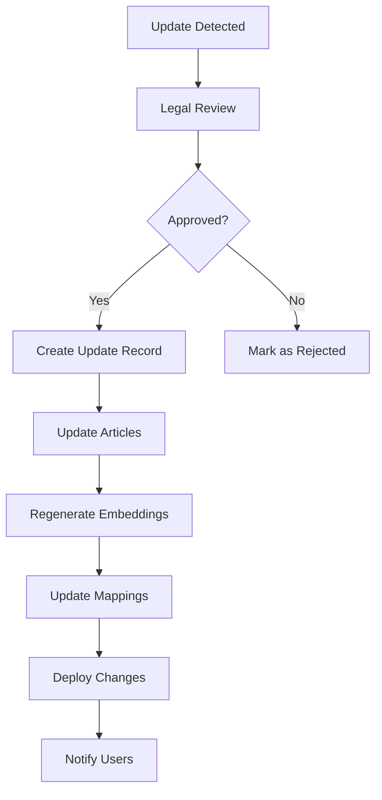

# Saudi Labor Law Update System

## Overview

This document describes the system design for keeping the Saudi labor law knowledge base current and up-to-date. The system provides automated monitoring, manual update processes, and versioning capabilities to ensure legal accuracy.

## System Components

### 1. Update Detection System

#### Automated Monitoring
- **Government Website Monitoring**: Periodic checks of official government websites for new decrees and amendments
- **RSS/Feed Integration**: Subscribe to official government news feeds and legal update services
- **Version Tracking**: Maintain version history of all law sources

#### Manual Notification System
- **Admin Interface**: Allow authorized users to flag potential updates
- **Email Notifications**: Notify legal experts when updates are detected
- **Review Queue**: Maintain a queue of pending updates for legal review

### 2. Update Processing Pipeline



#### Processing Steps:
1. **Legal Review**: Expert validation of proposed changes
2. **Impact Assessment**: Analyze which articles and scenarios are affected
3. **Content Update**: Update article content, translations, and metadata
4. **Embedding Regeneration**: Create new embeddings for updated content
5. **Mapping Updates**: Update scenario mappings and HR categories
6. **Testing**: Validate search functionality with updated content
7. **Deployment**: Apply changes to production database
8. **Notification**: Inform users of significant changes

### 3. Version Control System

#### Article Versioning
- **Version Numbers**: Semantic versioning for each article (e.g., 1.0.0, 1.1.0)
- **Change History**: Complete audit trail of all modifications
- **Rollback Capability**: Ability to revert to previous versions
- **Effective Dates**: Track when changes take effect

#### Database Schema for Updates
```sql
-- Law update tracking (already implemented)
CREATE TABLE law_update_history (
  id UUID PRIMARY KEY DEFAULT gen_random_uuid(),
  article_id UUID REFERENCES saudi_law_articles(id),
  update_type TEXT NOT NULL, -- 'created', 'modified', 'repealed', 'replaced'
  old_content_ar TEXT,
  old_content_en TEXT,
  new_content_ar TEXT,
  new_content_en TEXT,
  effective_date DATE,
  source_reference TEXT,
  notes TEXT,
  created_at TIMESTAMP WITH TIME ZONE DEFAULT NOW()
);

-- Update notifications
CREATE TABLE update_notifications (
  id UUID PRIMARY KEY DEFAULT gen_random_uuid(),
  update_id UUID REFERENCES law_update_history(id),
  user_id UUID REFERENCES auth.users(id),
  notification_type TEXT NOT NULL, -- 'email', 'in_app', 'sms'
  sent_at TIMESTAMP WITH TIME ZONE,
  opened_at TIMESTAMP WITH TIME ZONE,
  created_at TIMESTAMP WITH TIME ZONE DEFAULT NOW()
);
```

### 4. Update Categories

#### Major Updates
- **New Laws**: Complete new regulations or major overhauls
- **Article Replacements**: Significant changes to existing articles
- **Category Changes**: Updates that affect multiple articles or categories

#### Minor Updates
- **Text Corrections**: Typos, translation improvements, clarifications
- **Metadata Updates**: Keywords, categories, or mapping changes
- **Technical Updates**: Database optimizations or search improvements

### 5. Change Detection Methods

#### Content-Based Detection
```typescript
interface ChangeDetection {
  contentHash: string;
  lastModified: Date;
  sourceUrl: string;
  checksum: string;
}

// Content comparison algorithm
function detectChanges(currentContent: string, newContent: string): Change[] {
  // Implementation would include:
  // - Text diff algorithms
  // - Semantic similarity checks
  // - Keyword extraction and comparison
  // - Structure analysis
}
```

#### Source Monitoring
- **Official Government Websites**: Regular scraping and content analysis
- **Legal Databases**: Integration with commercial legal update services
- **Expert Networks**: Manual submissions from legal professionals
- **User Feedback**: Community-driven update reporting

### 6. Quality Assurance Process

#### Validation Steps
1. **Legal Expert Review**: Qualified legal professionals verify changes
2. **Translation Accuracy**: Ensure Arabic-English consistency
3. **Search Impact Testing**: Test how changes affect search results
4. **Integration Testing**: Verify system functionality after updates
5. **User Acceptance Testing**: Limited rollout to test users

#### Rollback Procedures
- **Immediate Rollback**: Quick revert for critical errors
- **Staged Rollback**: Gradual rollback for complex changes
- **Data Recovery**: Restore from versioned backups

### 7. User Communication

#### Notification Types
- **Breaking Changes**: Immediate notifications for significant updates
- **Periodic Summaries**: Weekly/monthly update digests
- **Category-Specific**: Notifications based on user interests
- **Search Result Changes**: When search results may be affected

#### Communication Channels
- **Email Notifications**: Detailed change summaries
- **In-App Messages**: Quick updates and alerts
- **Dashboard Updates**: Visual indicators of recent changes
- **API Webhooks**: For system integrations

### 8. Implementation Schedule

#### Phase 1: Foundation (Weeks 1-2)
- [ ] Implement basic update tracking tables
- [ ] Create manual update interface
- [ ] Set up change detection algorithms
- [ ] Establish legal review process

#### Phase 2: Automation (Weeks 3-4)
- [ ] Build automated monitoring system
- [ ] Implement notification system
- [ ] Create update processing pipeline
- [ ] Add version control features

#### Phase 3: Integration (Weeks 5-6)
- [ ] Integrate with external legal sources
- [ ] Build admin dashboard
- [ ] Implement user notification preferences
- [ ] Add analytics and reporting

#### Phase 4: Optimization (Weeks 7-8)
- [ ] Performance optimization
- [ ] Advanced change detection
- [ ] Machine learning for update prediction
- [ ] Full system testing

### 9. Maintenance Procedures

#### Daily Tasks
- [ ] Check automated monitors for new updates
- [ ] Review pending legal reviews
- [ ] Monitor system performance
- [ ] Handle user feedback

#### Weekly Tasks
- [ ] Review and approve minor updates
- [ ] Generate update summaries
- [ ] Analyze search impact metrics
- [ ] Update documentation

#### Monthly Tasks
- [ ] Comprehensive legal review
- [ ] System performance analysis
- [ ] User satisfaction surveys
- [ ] Strategic planning updates

#### Quarterly Tasks
- [ ] Major system updates
- [ ] Legal expert consultations
- [ ] Compliance audits
- [ ] Process improvements

### 10. Risk Management

#### Risk Categories
- **Legal Accuracy**: Incorrect or outdated legal information
- **System Downtime**: Update process causing service interruption
- **Data Loss**: Corruption during update process
- **Translation Errors**: Inconsistencies between Arabic and English
- **Search Impact**: Updates affecting search quality

#### Mitigation Strategies
- **Multiple Review Stages**: Layered validation process
- **Staged Deployments**: Gradual rollout of changes
- **Automated Backups**: Regular data snapshots
- **Professional Translation**: Expert Arabic-English translation
- **A/B Testing**: Compare search results before/after updates

### 11. Compliance and Auditing

#### Audit Trail Requirements
- **Complete Change History**: Every modification recorded
- **User Attribution**: Track who made each change
- **Timestamp Accuracy**: Precise timing of all updates
- **Source Documentation**: Reference to original update sources

#### Compliance Checks
- **Legal Accuracy**: Regular validation by qualified experts
- **Data Protection**: Ensure user privacy during updates
- **System Security**: Maintain security during update process
- **Regulatory Compliance**: Meet all applicable regulations

### 12. Performance Monitoring

#### Key Metrics
- **Update Frequency**: Number of updates per time period
- **Processing Time**: Time from detection to deployment
- **Error Rates**: Failed updates or rollbacks
- **User Satisfaction**: Feedback on update quality
- **Search Performance**: Impact on search accuracy

#### Monitoring Tools
- **Dashboard Analytics**: Real-time update metrics
- **Log Analysis**: Detailed process logging
- **User Feedback**: Systematic collection and analysis
- **Performance Benchmarks**: Comparison with baseline metrics

## Conclusion

This update system ensures that the Saudi labor law knowledge base remains current, accurate, and reliable. The combination of automated monitoring, expert review, and systematic deployment processes provides a robust foundation for maintaining legal accuracy while minimizing system disruption.

Regular maintenance, continuous improvement, and user feedback integration will ensure the system evolves to meet changing needs while maintaining the highest standards of legal accuracy and system reliability.