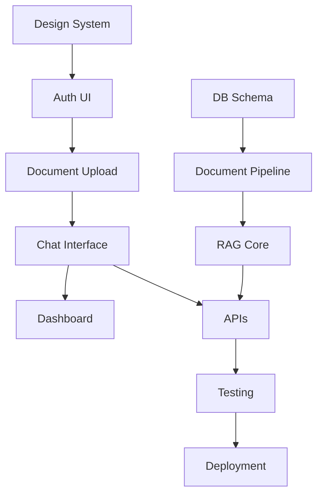

# MASTER COORDINATION PLAN
## HR Business Consultant RAG Service Implementation

### Project Overview
Building an AI-powered HR consultation platform for Saudi Arabian companies, integrating Saudi labor law with company-specific policies through RAG technology.

### Implementation Strategy
**Phase-First Approach**: Frontend → Backend → Integrations → Testing

### Agent Allocation Strategy
Each task will be assigned to specialized agents from `.claude/agents/`:
- **UI/UX Design Tasks** → `ui-ux-designer.md`
- **Frontend Implementation** → `frontend-developer.md`
- **Backend Architecture** → `backend-architect.md`
- **RAG System** → `ai-engineer.md`
- **Deployment & CI/CD** → `deployment-engineer.md`
- **Bug Fixes** → `debugger.md`
- **Prompt Optimization** → `prompt-engineer.md`

---

## PHASE 1: FRONTEND DEVELOPMENT (Days 1-7)
**Lead Agent**: `frontend-developer.md`
**Support**: `ui-ux-designer.md`

### 1.1 Design System & UI Planning (Day 1)
- TASK-001: Create design system for HR platform
- TASK-002: Design Arabic/English language switcher
- TASK-003: Create RTL layout support system
- TASK-004: Design professional Saudi business aesthetic

### 1.2 Authentication & User Management UI (Day 2)
- TASK-005: Modify auth UI for multi-tenant support
- TASK-006: Create organization onboarding flow
- TASK-007: Implement role selection interface (HR Manager/Staff/Viewer)
- TASK-008: Add 2FA setup interface

### 1.3 Document Management Interface (Day 3)
- TASK-009: Create document upload component with drag-drop
- TASK-010: Build document categorization interface
- TASK-011: Implement document viewer with version control UI
- TASK-012: Create bulk upload interface

### 1.4 Chat & Query Interface (Day 4)
- TASK-013: Build main chat interface component
- TASK-014: Implement message history sidebar
- TASK-015: Create source attribution display
- TASK-016: Add response rating system

### 1.5 Dashboard & Analytics (Day 5)
- TASK-017: Create main dashboard layout
- TASK-018: Build usage statistics components
- TASK-019: Implement compliance status indicators
- TASK-020: Add query analytics visualization

### 1.6 Template & Document Generation (Day 6)
- TASK-021: Create template library interface
- TASK-022: Build document generation form
- TASK-023: Implement template preview system
- TASK-024: Add export options interface

### 1.7 Subscription & Billing UI (Day 7)
- TASK-025: Modify pricing page for HR tiers
- TASK-026: Create usage limits display
- TASK-027: Build billing history interface
- TASK-028: Implement upgrade/downgrade flow

---

## PHASE 2: BACKEND ARCHITECTURE (Days 8-14)
**Lead Agent**: `backend-architect.md`
**Support**: `ai-engineer.md`

### 2.1 Database Schema & Multi-tenancy (Day 8)
- TASK-029: Design multi-tenant database schema
- TASK-030: Create RLS policies for data isolation
- TASK-031: Implement organization management tables
- TASK-032: Set up user roles and permissions

### 2.2 Document Processing Pipeline (Day 9)
- TASK-033: Create document upload API
- TASK-034: Implement text extraction service
- TASK-035: Build document indexing system
- TASK-036: Set up document storage structure

### 2.3 RAG System Core (Days 10-11)
- TASK-037: Set up vector database (Pinecone/Weaviate)
- TASK-038: Implement document embedding pipeline
- TASK-039: Create retrieval system
- TASK-040: Build response generation service
- TASK-041: Implement context management

### 2.4 API Development (Day 12)
- TASK-042: Create chat/query endpoints
- TASK-043: Build document management APIs
- TASK-044: Implement template generation endpoints
- TASK-045: Create analytics APIs

### 2.5 Integration Services (Day 13)
- TASK-046: Integrate Stripe subscription tiers
- TASK-047: Set up email notification system
- TASK-048: Implement file storage service
- TASK-049: Create audit logging system

### 2.6 Saudi Labor Law Data (Day 14)
- TASK-050: Prepare Saudi labor law dataset
- TASK-051: Create law update mechanism
- TASK-052: Build compliance validation rules
- TASK-053: Implement Arabic language processing

---

## PHASE 3: AI & PROMPT ENGINEERING (Days 15-17)
**Lead Agent**: `ai-engineer.md`
**Support**: `prompt-engineer.md`

### 3.1 RAG Optimization (Day 15)
- TASK-054: Fine-tune retrieval algorithms
- TASK-055: Optimize chunk size and overlap
- TASK-056: Implement hybrid search (keyword + semantic)
- TASK-057: Create relevance scoring system

### 3.2 Prompt Engineering (Day 16)
- TASK-058: Design system prompts for HR context
- TASK-059: Create role-specific prompt templates
- TASK-060: Implement prompt chaining for complex queries
- TASK-061: Build guardrails for legal accuracy

### 3.3 Template Generation System (Day 17)
- TASK-062: Create HR document templates
- TASK-063: Build dynamic template filling logic
- TASK-064: Implement compliance validation
- TASK-065: Add Arabic template support

---

## PHASE 4: TESTING & DEPLOYMENT (Days 18-20)
**Lead Agent**: `deployment-engineer.md`
**Support**: `debugger.md`

### 4.1 Testing & QA (Day 18)
- TASK-066: Frontend component testing
- TASK-067: API endpoint testing
- TASK-068: RAG accuracy testing
- TASK-069: Multi-tenant isolation testing

### 4.2 Performance Optimization (Day 19)
- TASK-070: Frontend performance audit
- TASK-071: Query response optimization
- TASK-072: Database query optimization
- TASK-073: Caching implementation

### 4.3 Deployment Setup (Day 20)
- TASK-074: Configure production environment
- TASK-075: Set up CI/CD pipeline
- TASK-076: Implement monitoring and logging
- TASK-077: Create backup and recovery system

---

## Critical Path Dependencies

## Parallelization Opportunities

### Frontend Parallel Tracks
- **Track 1**: Design system + Auth UI
- **Track 2**: Document management + Templates
- **Track 3**: Chat interface + Dashboard

### Backend Parallel Tracks
- **Track 1**: Database schema + Multi-tenancy
- **Track 2**: Document processing + Storage
- **Track 3**: Saudi law data preparation

## Risk Mitigation

| Risk | Impact | Mitigation | Owner |
|------|--------|------------|-------|
| Arabic RTL complexity | High | Early prototyping with ui-ux-designer | frontend-developer |
| RAG accuracy issues | Critical | Extensive testing with prompt-engineer | ai-engineer |
| Multi-tenant data leaks | Critical | Thorough RLS testing with debugger | backend-architect |
| Saudi law updates | High | Automated update mechanism | ai-engineer |

## Success Metrics
- [ ] All frontend components responsive and RTL-ready
- [ ] 95% RAG query accuracy achieved
- [ ] <3 second response time for queries
- [ ] Zero data isolation breaches in testing
- [ ] All core MVP features implemented

## Communication Protocol
1. Daily status updates in EXECUTION-TRACKER.md
2. Task completion logged in TASK-STATUS-TRACKER.yaml
3. Blockers escalated immediately
4. Agent handoffs documented clearly

## Resource Requirements
- **Frontend Developer**: 7 days focused work
- **Backend Architect**: 7 days focused work
- **AI Engineer**: 3 days focused work
- **UI/UX Designer**: 2 days consultation
- **Deployment Engineer**: 3 days focused work
- **Debugger**: On-call throughout